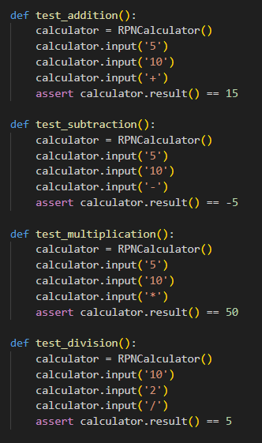

<h1 align="center"> Reverse Polish Notation Calculator </h1>

By: Yousef Ali (22002656), Bassam Ali (21047697)
---------------------

We have implemented a RPN calculator by using our raspberry pi 0 to manipulate our matrix keypad and oled screen. We have also built a library for the oled screen. In RPN, operators are written after their operands, rather than between them like in the more familiar algebraic notation.

For instance, the expression "3 + 4"  would be written as "3 4 + " in RPN notation. This means "take the number 3, then the number 4, then add them together."

<h1 align="center"> Instructions to run </h1>

1. Compile and Install Library: Run <mark>cd oled_lib </mark>, then run <mark>python setup.py</mark>
2. Go back to previous directory and run <mark>cd ../</mark>
2. Now you can run the main file using <mark>python main.py</mark>

# Software (Task 1)

The software for the RPN calculator is written in Python and is split into several modules:

main.py: This is the main module that runs the RPN calculator. It initializes the keypad and OLED display, and then enters a loop that waits for user input. When the user enters a number or operator, the program performs the appropriate action (e.g. pushing the number onto the stack or performing the calculation) and updates the display accordingly.
keypad.py: This module contains the code for reading input from the keypad. It uses the gpiozero library to listen for keypress events and maps the keys to their corresponding numbers and operators.
display.py: This module contains the code for updating the OLED display. It uses the adafruit_ssd1306 library to create a display object and writes text to the display using the text() method.

# Hardware components (Task 2)

Components Used: 

* Raspberry pi zero w 
* 4 x 4 Matrix Keypad 
* 64 x 32 pixel OLED screen 

<h1 align="left"> Stack Implementation  </h1>

The RPN calculator uses a stack data structure to perform the calculations. The stack is initialized as an empty list at the start of the program.

The simple stack implementation consists of a Python class called Stack, which initializes an empty list to store the elements of the stack. The class provides the following methods:

push(val): adds an element to the top of the stack by appending it to the list.

pop(): removes and returns the most recently added element from the top of the stack.

size(): returns the current size of the stack by returning the length of the list.

is_empty(): returns True if the stack is empty, and False otherwise.

print(): prints the contents of the stack as a list.

The Stack class provides a simple and efficient way to implement a stack in Python. It was used in this project to implement the RPN calculator's stack, which stores the operands and intermediate results during the calculations.

<h1 align="left"> Written Tests  </h1>

We developed several tests to examine if the infix expression converter works and if the basic operands such as +, -, /, * work the way they should.

<h1 align="left"> UML diagram  </h1>

