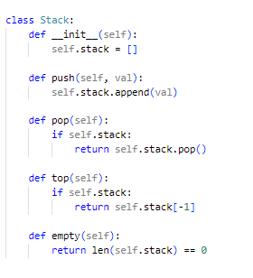
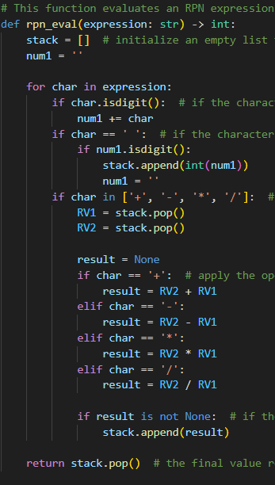

<h1 align="center"> Reverse Polish Notation Calculator </h1>

By: Yousef Ali (22002656), Bassam Ali (21047697)
---------------------

We have implemented a RPN calculator by using our raspberry pi 0 to manipulate our matrix keypad and oled screen. We have also built a library for the oled screen. In RPN, operators are written after their operands, rather than between them like in the more familiar algebraic notation.

For instance, the expression "3 + 4"  would be written as "3 4 + " in RPN notation. This means "take the number 3, then the number 4, then add them together."

<h1 align="center"> Instructions to run </h1>

1. Compile and Install Library: Run <mark>cd oled_lib </mark>, then run <mark>python setup.py</mark>
2. Go back to previous directory, run <mark>cd ../</mark>
2. Now you can run the main file using <mark>python main.py</mark>

# Software (Task 1)

The software for the RPN calculator is written in Python and is split into several files:

main.py: Sets up a matrix keypad and defines functions to handle input from the keypad. The input is then processed using a stack and an RPN calculator algorithm to evaluate mathematical expressions. The output is displayed on an OLED screen. The code also includes error handling for incorrect input.

rpn.py: This program evaluates mathematical expressions entered by the user in either infix or postfix notation, it uses the shunt function from the sy.py file to convert infix notation to postfix notation, and the rpn_eval function to evaluate expressions in postfix notation. The check_string function takes a string as input and checks whether it is a valid expression. If the string ends with a digit, it is assumed to be in infix notation and is converted to postfix notation using the shunt function. Otherwise, the string is assumed to be in postfix notation. The resulting postfix expression is then evaluated using the rpn_eval function.

<h1 align="left"> Stack Implementation  </h1>

The RPN calculator uses a stack data structure to perform the calculations. The stack is initialized as an empty list at the start of the program.

The simple stack implementation consists of a Python class called Stack, which initializes an empty list to store the elements of the stack. The class provides the following methods:

push(val): adds an element to the top of the stack by appending it to the list.

pop(): removes and returns the most recently added element from the top of the stack.

size(): returns the current size of the stack by returning the length of the list.

is_empty(): returns True if the stack is empty, and False otherwise.

print(): prints the contents of the stack as a list.

The Stack class provides a simple and efficient way to implement a stack in Python. It was used in this project to implement the RPN calculator's stack, which stores the operands and intermediate results during the calculations.

# RPN Function Implementation

The "rpn_eval" function evaluates an expression in RPN format by using a stack to keep track of the values as they are processed and applying the appropriate operations to those values as the expression is evaluated.

Below is an image showing the RPN works. 

<h1 align="left"> Written Tests  </h1>

We developed several tests to examine if the infix expression converter works and if the basic operands such as +, -, /, * work the way they should. We ran the tests using pytest to install pytest run: <mark>pip install pytest</mark> then run: <mark>pytest --capture=no Unittests.py</mark> to start the tests.

# Hardware components (Task 2)

Components Used: 

* Raspberry pi zero w 
* 4 x 4 Matrix Keypad 
* 64 x 32 pixel OLED screen 

The OLED screen and the keypad do work but the rasberry pi was facing connectivity issues so we could not run the program and done the tests, unfortunately the raspberrypi was refusing to connect to the internet so we couldnt install the necessarcy libraries and headers to complete this project but we are fairly certain that the code provided with this repositry will run with no issues. Below you can see the keypad works fine. 

<h1> UML diagram  </h1>

The UML diagram provided is a basic representation of the classes and their relationships in the system. The UML diagram is intended to provide a visual overview of the system and its functionality.

